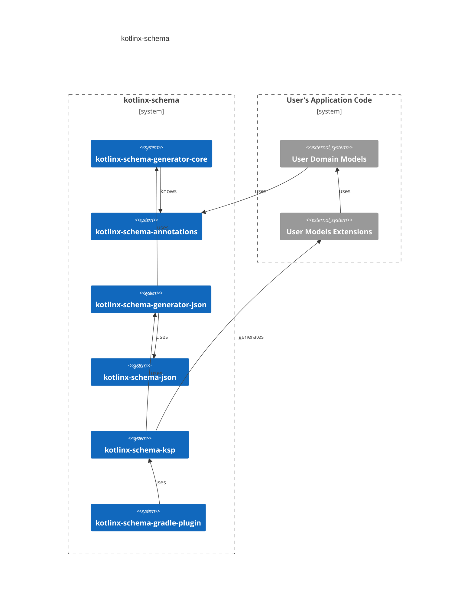
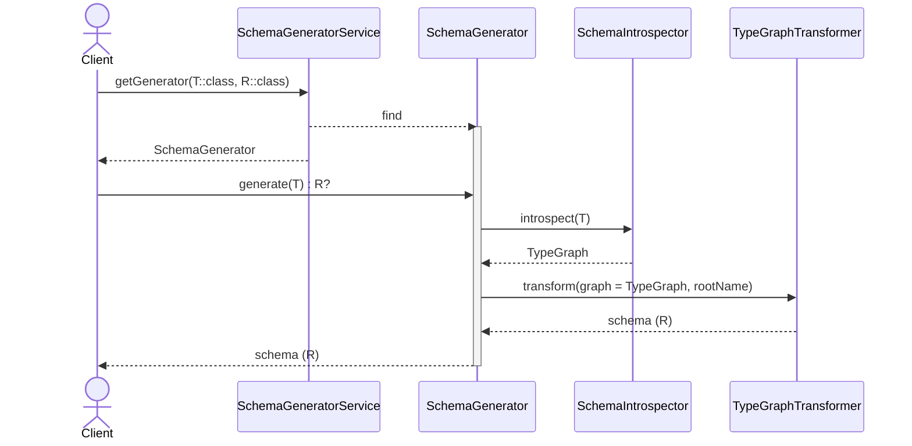

[](https://confluence.jetbrains.com/display/ALL/JetBrains+on+GitHub)
[](https://confluence.jetbrains.com/display/ALL/JetBrains+on+GitHub)

[](https://central.sonatype.com/search?q=org.jetbrains.kotlinx%2Fkotlinx-schema-*)
[](https://github.com/Kotlin/kotlinx-schema/actions/workflows/build.yml)
[](https://github.com/Kotlin/kotlinx-schema/actions/workflows/github-code-scanning/codeql)
[](https://kotlin.github.io/kotlinx-schema/)
[](examples)

[](http://kotlinlang.org)
[](https://kotlinlang.org/docs/multiplatform.html)
[](http://java.com)
[](LICENSE)


# kotlinx-schema

**Generate JSON schemas and LLM function calling schemas from Kotlin code — including classes you don't own.**

> [!IMPORTANT]
> This library is **experimental**. 
> Some parts might eventually be part of [kotlinx-serialization](https://github.com/Kotlin/kotlinx.serialization).

## Key Features

**Dual Generation Modes:**
- **Compile-time (KSP)**: Zero runtime overhead, multiplatform, for your annotated classes
- **Runtime (Reflection)**: JVM-only, for any class including third-party libraries

**LLM Integration:**
- First-class support for OpenAI/Anthropic function calling format
- Automatic strict mode and parameter validation
- Function name and description extraction

**Flexible Annotation Support:**
- Recognizes `@Description`, `@LLMDescription`, `@JsonPropertyDescription`, `@P`, and more
- Works with annotations from Jackson, LangChain4j, Koog without code changes

**Comprehensive Type Support:**
- Enums, collections, maps, nested objects, nullability, generics (with star-projection)
- Sealed class hierarchies with automatic `oneOf`/discriminator generation
- Proper union types for nullable parameters (`["string", "null"]`)
- Type constraints (min/max, patterns, formats)
- **Default values** (compile-time: tracked but not extracted; runtime: fully extracted)

**Developer Experience:**
- Gradle plugin for one-line setup
- Type-safe Kotlin DSL for programmatic schema construction
- Works everywhere: JVM, JS, iOS, macOS, Wasm

## Why kotlinx-schema?

This library solves three key challenges:

1. **🤖 LLM Function Calling Integration**: Generate OpenAI/Anthropic-compatible function schemas directly from Kotlin functions with proper type definitions and descriptions
2. **📦 Third-Party Class Support**: Create schemas for library classes without modifying their source code (Spring entities, Ktor models, etc.)
3. **🔄 Multi-Framework Compatibility**: Works with existing annotations from Jackson, LangChain4j, Koog, and more — no code changes needed

### When to Use

* 🤖 Building LLM-powered applications with structured function calling (OpenAI, Anthropic, Claude, MCP)
* 👽 Need schemas for third-party library classes you cannot modify
* ✅ Already using `@Description`-like annotations from other frameworks
* 👌 Want zero runtime overhead with compile-time generation (multiplatform support)
* ☕️ Need dynamic schema generation at runtime via reflection (JVM)

## Quick Start

Recommended: use the Gradle plugin.
It applies KSP for you, wires generated sources, and sets up task dependencies.

Refer to the example projects [here](./examples).

### Annotate Your Models

```kotlin
/**
 * A postal address for deliveries and billing.
 */
@Schema
data class Address(
    @Description("Street address, including house number") val street: String,
    @Description("City or town name") val city: String,
    @Description("Postal or ZIP code") val zipCode: String,
    @Description("Two-letter ISO country code; defaults to US") val country: String = "US",
)
```

> **Note:** KDoc comments on classes can also be used as descriptions.

### Configuration

### Using Standard KSP Plugin

You can configure KSP processor manually using the standard Google KSP plugin.

#### Multiplatform (metadata processing)

```kotlin
plugins {
    kotlin("multiplatform")
    id("com.google.devtools.ksp") version "2.1.0-1.0.29" // Use KSP version matching your Kotlin version
}

dependencies {
    // Add KSP processor for metadata (common code)
    add("kspCommonMainMetadata", "org.jetbrains.kotlinx:kotlinx-schema-ksp:<version>")

    // Runtime dependencies
    implementation("org.jetbrains.kotlinx:kotlinx-schema-annotations:<version>")
    implementation("org.jetbrains.kotlinx:kotlinx-serialization-json:<version>")
}

kotlin {
    sourceSets.commonMain {
        // Make generated sources visible to metadata compilation
        kotlin.srcDir("build/generated/ksp/metadata/commonMain/kotlin")
    }
}

tasks.withType<org.jetbrains.kotlin.gradle.dsl.KotlinCompile<*>>().all {
    if (name != "kspCommonMainKotlinMetadata") {
        dependsOn("kspCommonMainKotlinMetadata")
    }
}
```

#### JVM Only

```kotlin
plugins {
    kotlin("jvm")
    id("com.google.devtools.ksp") version "2.1.0-1.0.29" // Use KSP version matching your Kotlin version
}

dependencies {
    // Add KSP processor for main source set
    ksp("org.jetbrains.kotlinx:kotlinx-schema-ksp:<version>")

    // Runtime dependencies
    implementation("org.jetbrains.kotlinx:kotlinx-schema-annotations:<version>")
    implementation("org.jetbrains.kotlinx:kotlinx-serialization-json:<version>")
}

// Make generated sources visible to compilation
sourceSets.main {
    kotlin.srcDir("build/generated/ksp/main/kotlin")
}
```

> **Note:** The KSP plugin version should match your Kotlin version. See the [KSP release table](https://github.com/google/ksp/releases) for compatibility.

### Use the Generated Extensions

```kotlin
val schemaString: String = Address::class.jsonSchemaString
val schemaObject: kotlinx.serialization.json.JsonObject = Address::class.jsonSchema
```

### Using the Gradle Plugin (WIP)
<details>
<summary>This is "work in progress" yet</summary>

_Gradle plugin "org.jetbrains.kotlinx.schema.ksp" isn't yet available on Gradle Plugins portal._

**Kotlin Multiplatform:**

```kotlin
plugins {
    kotlin("multiplatform")
    id("org.jetbrains.kotlinx.schema.ksp") // version "<x.y.z>" if used outside this repository
}

// Configuration (all options are optional)
kotlinxSchema {
    // Enable or disable schema generation (optional, default: true)
    enabled.set(true)

    // Process only classes in this package and subpackages (optional, speeds up builds)
    // Omit to process all packages
    rootPackage.set("com.example.models")

    // Generate jsonSchema: JsonObject property in addition to jsonSchemaString (optional, default: false)
    // Can also be set per-class via @Schema(withSchemaObject = true)
    // Global setting here overrides per-class annotations
    withSchemaObject.set(true)
}

kotlin {
    compilerOptions {
        // Recommended: Apply annotations to both constructor params and properties
        freeCompilerArgs.add("-Xannotation-default-target=param-property")
    }

    // Configure your targets
    jvm()
    js { nodejs() }
    wasmJs { browser() }
    iosArm64()
    iosSimulatorArm64()

    sourceSets {
        commonMain {
            dependencies {
                // Required: Annotations for your code
                implementation("org.jetbrains.kotlinx:kotlinx-schema-annotations:<version>")
                // Required: For JsonObject in runtime APIs
                implementation("org.jetbrains.kotlinx:kotlinx-serialization-json:<version>")
            }
        }
    }
}
```

**Single-target JVM:**

```kotlin
plugins {
    kotlin("jvm")
    id("org.jetbrains.kotlinx.schema.ksp") // version "<x.y.z>" if used outside this repository
}

// Configuration (all options are optional)
kotlinxSchema {
    enabled.set(true)              // Optional, default: true
    rootPackage.set("com.example") // Optional, speeds up builds
    withSchemaObject.set(false)    // Optional, default: false
}

dependencies {
    implementation("org.jetbrains.kotlinx:kotlinx-schema-annotations:<version>")
    implementation("org.jetbrains.kotlinx:kotlinx-serialization-json:<version>")
}
```

**Notes:**
- You do NOT need to apply the KSP plugin yourself — the Gradle plugin does it.
- You do NOT need to add generated source directories — the plugin does it.
- For an example project, see [gradle-plugin-integration-tests](./gradle-plugin-integration-tests).
</details>

### Configuration Options

##### `enabled`
Enable or disable schema generation.
- **Type:** `Boolean`
- **Default:** `true`
- **Example:** `enabled.set(false)`

##### `rootPackage`
Process only classes in the specified package and its subpackages. Improves build performance in large projects.
- **Type:** `String`
- **Default:** All packages
- **Example:** `rootPackage.set("com.example.models")`

##### `withSchemaObject`
Generate `jsonSchema: JsonObject` property in addition to `jsonSchemaString: String`.

- **Type:** `Boolean`
- **Default:** `false`
- **Precedence:**
  1. **Global option** (if set): Overrides all per-class annotations
  2. **Per-class annotation** (fallback): `@Schema(withSchemaObject = true)`

**Example with global setting:**
```kotlin
kotlinxSchema {
    withSchemaObject.set(true)  // Applies to ALL classes
}

@Schema(withSchemaObject = false)  // IGNORED - global setting takes precedence
data class User(val name: String)  // ✅ Generates both jsonSchemaString and jsonSchema

@Schema  // IGNORED - global setting takes precedence
data class Product(val id: Long)  // ✅ Generates both (due to global setting)
```

**Example with per-class annotations (no global setting):**
```kotlin
@Schema(withSchemaObject = true)   // ✅ Generates both extensions
data class User(val name: String)

@Schema(withSchemaObject = false)  // ✅ Only generates jsonSchemaString
data class Address(val street: String)

@Schema  // ✅ Only generates jsonSchemaString (annotation default)
data class Product(val id: Long)
```

## Runtime schema generation

For scenarios where compile-time generation isn't possible, use
[`ReflectionClassJsonSchemaGenerator`](kotlinx-schema-generator-json/src/main/kotlin/kotlinx/schema/generator/json/ReflectionClassJsonSchemaGenerator.kt)
and [`ReflectionFunctionCallingSchemaGenerator`](kotlinx-schema-generator-json/src/main/kotlin/kotlinx/schema/generator/json/ReflectionFunctionCallingSchemaGenerator.kt)
with Kotlin reflection (JVM only).

### Why Runtime Generation?

**Primary use case: Third-party library classes**

The compile-time (KSP) approach requires you to annotate classes with `@Schema`, which isn't possible for:
- Library classes (Spring entities, Ktor models, database classes)
- Framework-provided models
- Classes from dependencies you don't control

Runtime generation solves this by using reflection to analyze any class at runtime.

> [!IMPORTANT]
> **Limitations:**
> - KDoc annotations are not available at runtime
> - Function parameter defaults (e.g., `fun foo(x: Int = 5)`) cannot be extracted via reflection
> - Data class property defaults (e.g., `data class Config(val port: Int = 8080)`) ARE supported

### Usage

```kotlin
// Works with ANY class, even from third-party libraries
import com.thirdparty.library.User  // Not your code!

val generator = kotlinx.schema.generator.json.ReflectionClassJsonSchemaGenerator.Default
val schema: JsonObject = generator.generateSchema(User::class)
val schemaString: String = generator.generateSchemaString(User::class)
```

**Add dependency**: `org.jetbrains.kotlinx:kotlinx-schema-generator-json:<version>`

### Choosing Your Approach

| Approach                 | Best For                               | Pros                                                    | Cons                                           |
|--------------------------|----------------------------------------|---------------------------------------------------------|------------------------------------------------|
| **Compile-time (KSP)**   | Your own annotated classes             | Zero runtime cost, multiplatform                        | Only works for classes you own, no default value extraction |
| **Runtime (Reflection)** | Third-party classes, dynamic scenarios | Works with any class, extracts default values, foreign annotations | JVM only, small reflection overhead            |

**Decision guide**:
- ✅ Use **KSP** for your domain models in multiplatform projects
- ✅ Use **Reflection** for third-party library classes or when you need dynamic generation


## What Gets Generated

Schemas follow a `$id/$defs/$ref` layout. Example (pretty-printed):

```json
{
    "$id": "com.example.Address",
    "$defs": {
        "com.example.Address": {
            "type": "object",
            "properties": {
                "street": {
                    "type": "string",
                    "description": "Street address, including house number"
                },
                "city": {
                    "type": "string",
                    "description": "City or town name"
                },
                "zipCode": {
                    "type": "string",
                    "description": "Postal or ZIP code"
                },
                "country": {
                    "type": "string",
                    "description": "Two-letter ISO country code; defaults to US",
                    "default": "US"
                }
            },
            "required": [
                "street",
                "city",
                "zipCode"
            ],
            "additionalProperties": false,
            "description": "A postal address for deliveries and billing."
        }
    },
    "$ref": "#/$defs/com.example.Address"
}
```

- Enums are `type: string` with `enum: [...]` and carry `@Description` as `description`.
- Object properties include their inferred type schema and, when present, property-level `@Description` as `description`.
- **Default values** are automatically extracted and included in the schema when using **runtime reflection** (e.g., `val country: String = "US"` → `"default": "US"`). Note: KSP (compile-time) tracks which properties have defaults but cannot extract the actual values.
- Nullable properties are emitted as a union including `null`.
- Collections: `List<T>`/`Set<T>` → `{ "type":"array", "items": T }`; `Map<String, V>` →
  `{ "type":"object", "additionalProperties": V }`.
- Unknown/generic type parameters resolve to `kotlin.Any` with a minimal definition in `$defs`.

## Examples

### Basic data classes

Here's a practical example of a product model with various property types:

```kotlin
@Description("A purchasable product with pricing and inventory info.")
@Schema
data class Product(
    @Description("Unique identifier for the product")
    val id: Long,
    @Description("Human-readable product name")
    val name: String,
    @Description("Optional detailed description of the product")
    val description: String?,
    @Description("Unit price expressed as a decimal number")
    val price: Double,
    @Description("Whether the product is currently in stock")
    val inStock: Boolean = true,
    @Description("List of tags for categorization and search")
    val tags: List<String> = emptyList(),
)
```

Use the generated extensions:

```kotlin
val schema = Product::class.jsonSchemaString
val schemaObject = Product::class.jsonSchema
```

<details>
<summary>Generated JSON schema</summary>

```json
{
    "$id": "com.example.Product",
    "$defs": {
        "com.example.Product": {
            "type": "object",
            "properties": {
                "id": {
                    "type": "integer",
                    "description": "Unique identifier for the product"
                },
                "name": {
                    "type": "string",
                    "description": "Human-readable product name"
                },
                "description": {
                    "type": [
                        "string",
                        "null"
                    ],
                    "description": "Optional detailed description of the product"
                },
                "price": {
                    "type": "number",
                    "description": "Unit price expressed as a decimal number"
                },
                "inStock": {
                    "type": "boolean",
                    "description": "Whether the product is currently in stock",
                    "default": true
                },
                "tags": {
                    "type": "array",
                    "items": {
                        "type": "string"
                    },
                    "description": "List of tags for categorization and search",
                    "default": []
                }
            },
            "required": [
                "id",
                "name",
                "description",
                "price"
            ],
            "additionalProperties": false,
            "description": "A purchasable product with pricing and inventory info."
        }
    },
    "$ref": "#/$defs/com.example.Product"
}
```

</details>

### Enums with descriptions

Enums are supported with descriptions on both the enum class and individual values:

```kotlin
@Description("Current lifecycle status of an entity.")
@Schema
enum class Status {
    @Description("Entity is active and usable")
    ACTIVE,

    @Description("Entity is inactive or disabled")
    INACTIVE,

    @Description("Entity is pending activation or approval")
    PENDING,
}
```

<details>
<summary>Generated JSON schema</summary>

```json
{
    "$id": "com.example.Status",
    "$defs": {
        "com.example.Status": {
            "type": "string",
            "enum": [
                "ACTIVE",
                "INACTIVE",
                "PENDING"
            ],
            "description": "Current lifecycle status of an entity."
        }
    },
    "$ref": "#/$defs/com.example.Status"
}
```

</details>

### Nested objects

You can compose schemas by nesting annotated classes:

```kotlin
@Description("A person with a first and last name and age.")
@Schema
data class Person(
    @Description("Given name of the person")
    val firstName: String,
    @Description("Family name of the person")
    val lastName: String,
    @Description("Age of the person in years")
    val age: Int,
)

@Description("An order placed by a customer containing multiple items.")
@Schema
data class Order(
    @Description("Unique order identifier")
    val id: String,
    @Description("The customer who placed the order")
    val customer: Person,
    @Description("Destination address for shipment")
    val shippingAddress: Address,
    @Description("List of items included in the order")
    val items: List<Product>,
    @Description("Current status of the order")
    val status: Status,
)
```

The generated schema for `Order` will automatically include definitions for all nested types (`Person`, `Address`,
`Product`, `Status`) in the `$defs` section, with appropriate `$ref` pointers to link them together. This makes it easy
to build complex, composable data models.

### Generic types

Generic classes are supported, with type parameters resolved at usage sites:

```kotlin
@Description("A generic container that wraps content with optional metadata.")
@Schema
data class Container<T>(
    @Description("The wrapped content value")
    val content: T,
    @Description("Arbitrary metadata key-value pairs")
    val metadata: Map<String, Any> = emptyMap(),
)
```

Generic type parameters are resolved at the usage site. When generating a schema for a generic class, unbound type
parameters (like `T`) are treated as `kotlin.Any` with a minimal definition in the `$defs` section. For more specific
typing, instantiate the generic class with concrete types when you need them.

### Sealed class polymorphism

The library automatically generates JSON schemas for Kotlin sealed class hierarchies using `oneOf` with discriminator support:

```kotlin
@Description("Represents an animal")
sealed class Animal {
    @Description("Animal's name")
    abstract val name: String

    @Description("Represents a dog")
    data class Dog(
        override val name: String,
        @Description("Dog's breed")
        val breed: String,
        @Description("Trained or not")
        val isTrained: Boolean = false,
    ) : Animal()

    @Description("Represents a cat")
    data class Cat(
        override val name: String,
        @Description("Cat's color")
        val color: String,
        @Description("Lives left")
        val lives: Int = 9,
    ) : Animal()
}

val generator = ReflectionClassJsonSchemaGenerator.Default
val schema = generator.generateSchema(Animal::class)
```

<details>
<summary>Generated JSON schema</summary>

```json
{
    "name": "com.example.Animal",
    "strict": false,
    "schema": {
        "type": "object",
        "additionalProperties": false,
        "description": "Represents an animal",
        "oneOf": [
            {
                "$ref": "#/$defs/Cat"
            },
            {
                "$ref": "#/$defs/Dog"
            }
        ],
        "discriminator": {
            "propertyName": "type",
            "mapping": {
                "Cat": "#/$defs/Cat",
                "Dog": "#/$defs/Dog"
            }
        },
        "$defs": {
            "Cat": {
                "type": "object",
                "description": "Represents a cat",
                "properties": {
                    "name": {
                        "type": "string",
                        "description": "Animal's name"
                    },
                    "color": {
                        "type": "string",
                        "description": "Cat's color"
                    },
                    "lives": {
                        "type": "integer",
                        "description": "Lives left",
                        "default": 9
                    }
                },
                "required": ["name", "color"],
                "additionalProperties": false
            },
            "Dog": {
                "type": "object",
                "description": "Represents a dog",
                "properties": {
                    "name": {
                        "type": "string",
                        "description": "Animal's name"
                    },
                    "breed": {
                        "type": "string",
                        "description": "Dog's breed"
                    },
                    "isTrained": {
                        "type": "boolean",
                        "description": "Trained or not",
                        "default": false
                    }
                },
                "required": ["name", "breed"],
                "additionalProperties": false
            }
        }
    }
}
```
</details>

**Key features:**
- **`oneOf` with `$ref`**: Each sealed subclass is referenced from a `$defs` section
- **Discriminator**: Automatically generated with `type` property mapping
- **Property inheritance**: Base class properties included in each subtype
- **Type safety**: Each subtype gets its own schema definition
- **Default values**: Subtype properties with defaults (like `lives: Int = 9`) are included

## Using @Schema and @Description annotations

### @Schema annotation

Mark classes with `@Schema` to generate extension properties for them:

```kotlin
@Schema  // Uses default schema type "json"
data class Address(val street: String, val city: String)

@Schema("json")  // Explicitly specify schema type
data class Person(val name: String, val age: Int)
```

**@Schema parameters:**
- `value = "json"`: Schema type (only JSON currently supported)
- `withSchemaObject = false`: Generate `jsonSchema: JsonObject` property (see [Advanced Configuration](#advanced-configuration))

**Note**: `jsonSchemaString` is always generated. `jsonSchema` requires `withSchemaObject = true`.

### @Description annotation

Use `@Description` on classes and properties to add human-readable documentation to your schemas:

```kotlin
@Description("A purchasable product with pricing info")
@Schema
data class Product(
    @Description("Unique identifier for the product") val id: Long,
    @Description("Human-readable product name") val name: String,
    @Description("Optional detailed description of the product") val description: String?,
    @Description("Unit price expressed as a decimal number") val price: Double,
)
```

**Tip**: With the recommended compiler flag `-Xannotation-default-target=param-property`, a bare `@Description` on a
primary constructor parameter also applies to the property. If you do not enable the flag, use `@param:Description` for
constructor-declared properties.

## Function calling schema generation for LLMs

Modern LLMs (OpenAI GPT-4, Anthropic Claude, etc.) use structured function calling to interact with your code. 
They require a specific JSON schema format that describes available functions, their parameters, and types.

### Why This Format?

LLM APIs need to know:
- What functions are available and what they do
- Parameter names, types, and descriptions
- Which parameters are required
- Type constraints (enums, formats, ranges)

This library automatically generates schemas that comply with the [OpenAI function calling specification](https://platform.openai.com/docs/guides/function-calling), making it easy to expose Kotlin functions to LLMs.

### Basic Usage

```kotlin
@Description("Get current weather for a location")
fun getWeather(
    @Description("City and country, e.g. 'London, UK'")
    location: String,

    @Description("Temperature unit")
    unit: String = "celsius"
): WeatherInfo {
    // Implementation...
}

val generator = ReflectionFunctionCallingSchemaGenerator.Default
val schema = generator.generateSchema(::getWeather)
```

### Generated Schema

The generated schema follows the LLM function calling format:

```json
{
  "type": "function",
  "name": "getWeather",
  "description": "Get current weather for a location",
  "strict": true,
  "parameters": {
    "type": "object",
    "properties": {
      "location": {
        "type": "string",
        "description": "City and country, e.g. 'London, UK'"
      },
      "unit": {
        "type": "string",
        "description": "Temperature unit"
      }
    },
    "required": ["location", "unit"],
    "additionalProperties": false
  }
}
```

### Key Features

- **Automatic extraction**: Function name and descriptions from `@Description` annotations
- **Default values**: Property defaults in nested data classes are automatically extracted (e.g., `data class Config(val port: Int = 8080)`)
- **Strict mode**: `strict: true` enables OpenAI's [strict mode](https://platform.openai.com/docs/guides/function-calling#strict-mode) for reliable parsing
- **Union types**: Nullable parameters use `["string", "null"]` instead of `nullable: true`
- **Required by default**: All parameters marked as required (OpenAI structured outputs requirement)
- **Type safety**: Proper JSON Schema types from Kotlin types (Int → integer, String → string, etc.)

> **Note:** Function parameter defaults (e.g., `unit: String = "celsius"`) cannot be extracted via reflection, but nested data class property defaults are fully supported.

### Working with Multiple Functions

```kotlin
// Define your functions
@Description("Search the knowledge base")
fun searchKnowledge(
    @Description("Search query") query: String,
    @Description("Max results") limit: Int = 10
): String = TODO()

@Description("Calculate order total with tax")
fun calculateTotal(
    @Description("Item prices") prices: List<Double>,
    @Description("Tax rate as decimal") taxRate: Double = 0.0
): Double = TODO()

// Generate schemas
val generator = ReflectionFunctionCallingSchemaGenerator.Default
val schemas = listOf(::searchKnowledge, ::calculateTotal)
    .map { generator.generateSchema(it) }

// Serialize to JSON
val jsonSchemas = schemas.map { Json.encodeToString(it) }

// Or get as JsonObject
val schemaObjects = schemas.map { it.encodeToJsonObject() }
```

The generated schemas can be sent to any LLM API that supports function calling (OpenAI, Anthropic, etc.). 
Integration with specific LLM providers requires their respective client libraries.

### Nullable Parameters

Nullable parameters are represented as union types:

```kotlin
@Description("Update user profile")
fun updateProfile(
    @Description("User ID") userId: String,
    @Description("New name, if changing") name: String? = null,
    @Description("New email, if changing") email: String? = null
): User = TODO("does not matter")// ...
```

Generates:

```json
{
    "properties": {
        "userId": {
            "type": "string",
            "description": "User ID"
        },
        "name": {
            "type": [
                "string",
                "null"
            ],
            "description": "New name, if changing"
        },
        "email": {
            "type": [
                "string",
                "null"
            ],
            "description": "New email, if changing"
        }
    },
    "required": [
        "userId",
        "name",
        "email"
    ]
}
```

**Note**: Even nullable parameters are in `required` array. The `null` type in the union indicates optionality.

For more details on function calling schemas and OpenAI compatibility, see [kotlinx-schema-json/README.md](kotlinx-schema-json/README.md#function-calling-schema-for-llm-apis).

## Multi-Framework Annotation Support

**You don't need to change your existing code!**

kotlinx-schema recognizes description annotations from multiple frameworks by their **simple name**, allowing you to generate schemas from code that uses annotations from other libraries.

### Supported Annotations

The library automatically recognizes these description annotations by default:

| Annotation                                                 | Simple Name               | Library/Framework | Example                               |
|------------------------------------------------------------|---------------------------|-------------------|---------------------------------------|
| `kotlinx.schema.Description`                               | `Description`             | kotlinx-schema    | `@Description("User name")`           |
| `ai.koog.agents.core.tools.annotations.LLMDescription`     | `LLMDescription`          | Koog AI agents    | `@LLMDescription("Query text")`       |
| `com.fasterxml.jackson.annotation.JsonPropertyDescription` | `JsonPropertyDescription` | Jackson           | `@JsonPropertyDescription("Email")`   |
| `com.fasterxml.jackson.annotation.JsonClassDescription`    | `JsonClassDescription`    | Jackson           | `@JsonClassDescription("User model")` |
| `dev.langchain4j.model.output.structured.P`                | `P`                       | LangChain4j       | `@P("Search query")`                  |

### How It Works

The introspector matches annotations by their **simple name only**, not the fully qualified name. This means:
- ✅ No code changes needed to generate schemas from existing annotated classes
- ✅ Can migrate between annotation libraries without modifying code
- ✅ Generate schemas for third-party code that uses different annotations
- ✅ Use your preferred annotation library while still getting schema generation

### Customizing Annotation Detection

Annotation detection is configurable via `kotlinx-schema.properties` loaded from the classpath.
The configuration file is **optional** — if not provided or fails to load, the library uses sensible defaults.

#### Default Configuration

By default, the library recognizes:

**Annotation names**: Description, LLMDescription, JsonPropertyDescription, JsonClassDescription, P
**Attribute names**: value, description

#### Adding Custom Annotations

To customize, place `kotlinx-schema.properties` in your project's resources:

```properties
# Add your custom annotations to the defaults
introspector.annotations.description.names=Description,MyCustomAnnotation,DocString
introspector.annotations.description.attributes=value,description,text
```

**Note**: The library falls back to built-in defaults if the configuration file is missing or cannot be loaded.

#### Example: Adding Support for a Custom Framework

```kotlin
// Your custom annotation
package com.mycompany.annotations

annotation class ApiDoc(val text: String)

// Usage in your models
@ApiDoc(text = "Customer profile information")
data class Customer(
    @ApiDoc(text = "Unique customer identifier")
    val id: Long,
    val name: String
)
```

Update `kotlinx-schema.properties`:
```properties
introspector.annotations.description.names=Description,ApiDoc
introspector.annotations.description.attributes=value,description,text
```

Now the schema generator will recognize `@ApiDoc` and extract descriptions from its `text` parameter.

### Example: Reusing Jackson Annotations

If your project already uses Jackson for JSON serialization, you can generate schemas from existing Jackson-annotated classes without any modifications. This is particularly useful for REST APIs and Spring Boot applications where Jackson annotations are already present.

```kotlin
// Existing code with Jackson annotations - NO CHANGES NEEDED!
@JsonClassDescription("Customer profile data")
data class Customer(
    @JsonPropertyDescription("Unique customer ID")
    val id: Long,

    @JsonPropertyDescription("Full name")
    val name: String,

    @JsonPropertyDescription("Contact email")
    val email: String
)

// Generate JSON schema without modifying the code
val generator = ReflectionJsonSchemaGenerator.Default
val schema = generator.generateSchema(Customer::class)

// Schema includes all Jackson descriptions!
```

### Example: LangChain4j Integration

LangChain4j uses the `@P` annotation for parameter descriptions in AI function calling. The library recognizes these annotations automatically, enabling seamless integration with existing LangChain4j codebases.

```kotlin
// Code using LangChain4j annotations
data class SearchQuery(
    @P("Search terms")
    val query: String,

    @P("Maximum results to return")
    val limit: Int = 10
)

// Generate schema for LLM function calling
val schema = ReflectionFunctionCallingSchemaGenerator.Default
    .generateSchema(SearchQuery::class)
```

### Example: Koog AI Agents

Koog AI framework uses `@LLMDescription` for documenting agent tools and parameters. The library supports both the verbose `description =` syntax and the shorthand form, making migration from Koog straightforward.

```kotlin
@LLMDescription(description = "Product with pricing information")
@Schema
data class Product(
    @LLMDescription(description = "Product identifier")
    val id: Long,

    @LLMDescription("Product name")
    val name: String,

    @LLMDescription("Unit price")
    val price: Double,
)
```

### Precedence Rules

If multiple description annotations are present on the same element, the library uses this precedence order:
1. `@Description` (kotlinx-schema's own annotation)
2. Other annotations in alphabetical order by simple name

**Tip**: For best compatibility, prefer `@Description` from kotlinx-schema when writing new code, but existing annotations from other libraries work seamlessly.

## JSON Schema DSL

For manual schema construction, use the [**kotlinx-schema-json**](kotlinx-schema-json) module.
It provides type-safe Kotlin models and a DSL for building JSON Schema definitions programmatically,
with full kotlinx-serialization support.

```kotlin
dependencies {
    implementation("org.jetbrains.kotlinx:kotlinx-schema-json:<version>")
}
```

**Quick Example:**

```kotlin
val schema = jsonSchema {
    name = "User"
    schema {
        property("id") {
            required = true
            string { format = "uuid" }
        }
        property("email") {
            required = true
            string { format = "email" }
        }
        // Polymorphic types with discriminators
        property("role") {
            oneOf {
                discriminator(propertyName = "type") {
                    "admin" mappedTo "#/definitions/AdminRole"
                    "user" mappedTo {
                        property("type") { string { constValue = "user" } }
                        property("permissions") { array { ofString() } }
                    }
                }
            }
        }
    }
}
```

**Features:**
- ✅ Type-safe property definitions (string, number, integer, boolean, array, object, reference)
- ✅ **Polymorphism**: oneOf, anyOf, allOf with elegant discriminator support
- ✅ Constraints: required, nullable, enum, const, min/max, format validation
- ✅ Nested schemas and arrays of complex types
- ✅ Full kotlinx-serialization integration
- ✅ Kotlin Multiplatform support

**📖 See [kotlinx-schema-json/README.md](kotlinx-schema-json/README.md) for comprehensive documentation** including:
- Complete DSL reference and API overview
- Polymorphism patterns (oneOf, anyOf, allOf)
- Discriminator usage with references and inline schemas
- Working with nested objects and arrays
- Serialization/deserialization examples
- Function calling schema for LLM APIs

## Project architecture



Top-level modules you might interact with:

- **kotlinx-schema-annotations** — runtime annotations: @Schema and @Description
- **kotlinx-schema-json** — type-safe models and DSL for building JSON Schema definitions programmatically
- **kotlinx-schema-generator-core** — internal representation (IR) for schema descriptions, introspection utils, generator interfaces
- **kotlinx-schema-generator-json** — JSON Schema transformer from the IR
- **kotlinx-schema-ksp** — KSP processor that scans your code and generates the extension properties:
    - `KClass<T>.jsonSchema: JsonObject`
    - `KClass<T>.jsonSchemaString: String`
- **kotlinx-schema-gradle-plugin** — Gradle plugin (id: "org.jetbrains.kotlinx.schema.ksp") that:
    - Applies KSP automatically
    - Adds the KSP processor dependency
    - Wires generated sources into your source sets
    - Sets up multiplatform task dependencies
- **gradle-plugin-integration-tests** — Independent build that includes the main project; demonstrates real MPP usage and integration testing
- **ksp-integration-tests** — KSP end‑to‑end tests for generation without the Gradle plugin

### Workflow


1. _Client_ (KSP Processor or Java class) calls _SchemaGeneratorService_ to lookup _SchemaGenerator_ 
   by target type T and expected schema class. _SchemaGeneratorService_ returns _SchemaGenerator_, if any.
2. _Client_ (KSP Processor or Java class) calls _SchemaGenerator_ to generate a Schema string representation, 
and, optionally, object a Schema string representation.
3. SchemaGenerator invokes SchemaIntrospector to convert an object into _TypeGraph_
4. _TypeGraphTransformer_ converts a _TypeGraph_ to a target representation (e.g., JSON Schema)
   and returns it to SchemaGenerator

## Building and Contributing

For build instructions, development setup, and contribution guidelines, see [CONTRIBUTING.md](CONTRIBUTING.md).

## Requirements

- Kotlin 2.2+
- KSP 2 (applied automatically when using the Gradle plugin)
- _kotlinx-serialization-json_ for JsonObject support

Tip: If you use `@Description` on primary constructor parameters, enable
`-Xannotation-default-target=param-property` in Kotlin compiler options so the description applies to the backing
property.

## Code of Conduct

This project and the corresponding community are governed by
the [JetBrains Open Source and Community Code of Conduct](https://github.com/jetbrains#code-of-conduct). Please make
sure you read and adhere to it.

## License

This project is licensed under the Apache License 2.0 - see the [LICENSE](LICENSE) file for details.
