# Architecture

`kotlinx-schema` is a layered library that generates schemas—primarily JSON Schema—from Kotlin declarations
and Java classes. It unifies compile-time analysis (KSP) and runtime inspection (reflection) by translating
both into a shared Internal Representation (IR).

The architecture is modular by design, so you can plug in new schema formats and generation strategies while
keeping behavior consistent across JVM, JS, Native, and Wasm.

**Architecture goals:**

- **Unified IR**: Separate schema sources (KSP, reflection, or [SerialDescriptor][kser-descriptor]) from output targets
- **Multiplatform (KSP)**: Support schema generation across all Kotlin targets.
- **Extensibility**: Enable third-party annotations, custom introspectors and transformations.
- **Zero runtime overhead on KSP**: Compile-time generation for performance-sensitive paths.
- **Third-party support**: Generate schemas for types you don't own without editing their source.

## Overview

The library implements the following pipeline: 

```mermaid
graph LR
    subgraph Sources["📦 SOURCES"]
        Kotlin["Kotlin Classes<br/>@Schema annotated"]
        KSerializer["SerialDescriptor"]
        Java["Java Classes<br/>Third-party libs"]
        Functions["Kotlin Functions"]
    end

    subgraph Introspectors["🔍 Stage 1: INTROSPECTORS"]
        KSP["KspSchemaIntrospector<br/><i>compile-time</i>"]
        Reflect["ReflectionSchemaIntrospector<br/><i>runtime</i>"]
        Serialization["SerializationClassSchemaIntrospector<br/><i>runtime</i>"]
    end

    subgraph IR["🧬 INTERNAL REPRESENTATION"]
        TypeGraph["TypeGraph<br/>Unified intermediate format<br/>Properties • Types • Descriptions<br/>Nullable • Defaults"]
    end

    subgraph Transformers["⚙️ TRANSFORMERS"]
        JsonTransform["JsonSchemaTransformer<br/>Draft 2020-12"]
        FuncTransform["FunctionCallingTransformer<br/>(OpenAI/Anthropic format)"]
    end

    subgraph Output["📄 SCHEMA OUTPUTS"]
        KtClass["Generated .kt<br/>MyClass::class.jsonSchema<br/>MyClass::class.jsonSchemaString"]
        KtFunc["Generated .kt<br/>myMethodJsonSchema()<br/>myMethodJsonSchemaString()"]
        JsonSchema["JsonSchema<br/>(@Serializable)"]
        JsonObj["JsonObject<br/>kotlinx.serialization"]
        JsonStr["JSON String<br/>Serialized schema"]
        FuncSchema["FunctionCallingSchema<br/>(@Serializable)"]
    end

    Kotlin --> KSP
    KSerializer --> Serialization
    Java --> Reflect
    Functions --> KSP
    Functions --> Reflect

    KSP --> TypeGraph
    Reflect --> TypeGraph
    Serialization --> TypeGraph

    TypeGraph --> JsonTransform
    TypeGraph --> FuncTransform

    JsonTransform --> JsonSchema
    FuncTransform --> FuncSchema
    JsonSchema --> JsonObj
    FuncSchema --> KtFunc
    JsonObj --> JsonStr
    JsonObj --> KtClass

    classDef sourceStyle fill:#e3f2fd,stroke:#1565c0,stroke-width:3px,color:#000
    classDef introspectorStyle fill:#fff3e0,stroke:#ef6c00,stroke-width:3px,color:#000
    classDef irStyle fill:#fce4ec,stroke:#c2185b,stroke-width:4px,color:#000
    classDef transformStyle fill:#f3e5f5,stroke:#7b1fa2,stroke-width:3px,color:#000
    classDef outputStyle fill:#e8f5e9,stroke:#2e7d32,stroke-width:3px,color:#000

    class Kotlin,Java,Functions,KSerializer sourceStyle
    class KSP,Reflect,Serialization introspectorStyle
    class TypeGraph irStyle
    class JsonTransform,FuncTransform transformStyle
    class KtClass,KtFunc,JsonSchema,FuncSchema,JsonObj,JsonStr outputStyle
```

**The Transformation Story:**

1. **Sources** — Kotlin classes, Java classes, Kotlin functions, or [SerialDescriptor][kser-descriptor] serve as input
2. **Introspectors** — Extract type information at compile-time (KSP) or runtime (Reflection, Serialization)
3. **TypeGraph** — Unified internal representation containing all type metadata
4. **Transformers** — Convert TypeGraph to JSON Schema or Function Calling format
5. **Outputs** — Generated Kotlin code, JsonSchema, FunctionCallingSchema, and then to JsonObject, or JSON strings

## Module Dependencies

Top-level modules you might interact with:

- **kotlinx-schema-annotations** — runtime annotations: @Schema and @Description
- **kotlinx-schema-json** — type-safe models and DSL for building JSON Schema definitions programmatically
- **kotlinx-schema-generator-core** — internal representation (IR) for schema descriptions, introspection utils,
  generator interfaces
- **kotlinx-schema-generator-json** — JSON Schema transformer from the IR, kotlinx-serialization schema generator
- **kotlinx-schema-ksp** — KSP processor that scans your code and generates the extension properties:
    - `KClass<T>.jsonSchema: JsonObject`
    - `KClass<T>.jsonSchemaString: String`
- **kotlinx-schema-gradle-plugin** — Gradle plugin (id: "org.jetbrains.kotlinx.schema.ksp") that:
    - Applies KSP automatically
    - Adds the KSP processor dependency
    - Wires generated sources into your source sets
    - Sets up multiplatform task dependencies
- **gradle-plugin-integration-tests** — Independent build that includes the main project; demonstrates real MPP usage
  and integration testing
- **ksp-integration-tests** — KSP end‑to‑end tests for generation without the Gradle plugin

### Workflow

1. _Client_ (KSP Processor or Java class) calls _SchemaGeneratorService_ to lookup _SchemaGenerator_
   by target type T and expected schema class. _SchemaGeneratorService_ returns _SchemaGenerator_, if any.
2. _Client_ (KSP Processor or Java class) calls _SchemaGenerator_ to generate a Schema string representation,
   and, optionally, object a Schema string representation.
3. SchemaGenerator invokes SchemaIntrospector to convert an object into _TypeGraph_
4. _TypeGraphTransformer_ converts a _TypeGraph_ to a target representation (e.g., JSON Schema)
   with respect to respecting _Config_ object and returns it to SchemaGenerator

[kser-descriptor]: https://kotlinlang.org/api/kotlinx.serialization/kotlinx-serialization-core/kotlinx.serialization.descriptors/-serial-descriptor/

